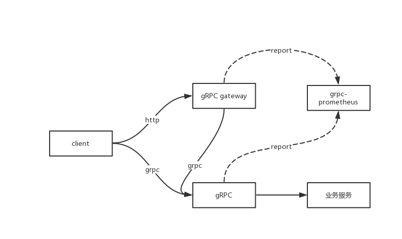

# 模板工程说明

golang的开发模板，模板集成了常用的一些最佳实践，可以帮助快速的开发应用。
推荐使用go1.12以上版本，使用go mod作为包管理工具。
go mod 私服代理使用配置

```bash
export GOPROXY=http://172.31.114.15:3001,direct
```

## 整体介绍



### 功能特性

> 1. 使用grpc定义服务，同时支持http+json和grpc的请求
> 2. 集成日志系统，降低单独集成成本；
> 3. 提供了metrics的暴露，无缝对接prometheus，方便独立的监控；
> 4. 开启grpc的reflect，可以使用grpcurl，BloomRPC等工具发起调用；
> 5. 支持优雅退出；

### 依赖说明

#### grpc-go

grpc的GO语言代码生成工具

**安装**

```shell
go get -u github.com/golang/protobuf/protoc-gen-go
```

#### grpc-gateway

可以把grpc服务包装成http+json的工具；

参考文档: [https://github.com/grpc-ecosystem/grpc-gateway](https://github.com/grpc-ecosystem/grpc-gateway)

**安装**

```shell
go get -u github.com/grpc-ecosystem/grpc-gateway/protoc-gen-grpc-gateway
```

#### grpc-gen-doc

grpc文档生成工具，可以生成html格式的模板；

```shell
go get -u github.com/pseudomuto/protoc-gen-doc/cmd/protoc-gen-doc
```

#### go-grpc-prometheus

grpc帮助grpc服务快速的暴露prometheus可以识别的metrics

参考文档： [https://github.com/grpc-ecosystem/go-grpc-prometheus](https://github.com/grpc-ecosystem/go-grpc-prometheus)

### 目录说明

```shell
.
├── README.md               // 框架说明
├── conf                    // 配置文件
│   ├── flume.yml
│   ├── seelog.xml
│   └── server.yml
├── demoapp.go              // 应用main入口
├── example                 // 示例脚本和文件
│   ├── post.txt
│   └── run.sh
├── go.mod
├── go.sum
├── internal                // 内部包
│   ├── config
│   │   ├── flume.go            // flume日志加载
│   │   ├── locallog.go         // 本地seelog日志加载
│   │   └── server.go           // service 配置加载
│   ├── dao                 // dao
│   ├── model               // model
│   ├── server              // 服务相关的目录
│   │   ├── gateway.go          // http服务的启动和停止
│   │   ├── grpc.go             // grpc服务的启动和停止
│   │   └── metrics.go          // metrics服务启动和停止
│   └── service             // 服务实现目录
│       └── grpc.go             // grpc 服务实现类
└── proto                   // 服务目录
    ├── generate.sh             // 生成代码的示例脚本
    └── service.proto           // grpc的proto定义
```

## 使用说明

> 1. 安装依赖的工具。
> 2. 编写自己的proto接口协议，并参考proto/generate.sh脚本生成代码
> 3. 在internal/service包下面实现自己的业务逻辑。
> 4. 修改框架中的关键todo。
> 5. enjoy.

service.proto

```protobuf
syntax = "proto3";

package proto;

import "google/api/annotations.proto";

message Request {
    string slang = 1; // source language
    string tlang = 2; // target language
    string text = 3; // original text
}

message Response {
    string retcode = 1; // return code
    string retdesc = 2; // return description
    string result = 3; // translate result
}

// Translate service
service TranslateService {
    // Translate method
    rpc Translate (Request) returns (Response) {
        option (google.api.http) = {
           post: "/v1/trans"
           body: "*"
       };
    }
}
```

## 功能

### grpc访问

```shell
# 服务成功的场景
➜  example grpcurl -plaintext -d '{"slang":"cmn-Hans-CN","tlang":"en-US","text":""}'  172.31.114.70:8111  proto.TranslateService/Translate
{
  "retcode": "000000",
  "retdesc": "success",
  "result": "mock"
}

# 服务超时的场景
➜  example grpcurl -plaintext -d '{"slang":"cmn-Hans-CN","tlang":"en-US","text":""}'  172.31.114.70:8111  proto.TranslateService/Translate
ERROR:
  Code: Unknown
  Message: server timeout
```

### http+json访问

```shell
# 服务超时的场景
➜  example curl -X POST http://172.31.114.70:8110/v1/trans -d '{"slang":"cmn-Hans-CN","tlang":"en-US","text":""}'
{"error":"server timeout","code":2,"message":"server timeout"}%

# 服务成功的场景
➜  example curl -X POST http://172.31.114.70:8110/v1/trans -d '{"slang":"cmn-Hans-CN","tlang":"en-US","text":""}'
{"retcode":"000000","retdesc":"success","result":"mock"}
```

## 性能测试

测试机器为本地服务器，grpc的测试工具是ghz，http的测试工具是ab，测试不是为了发现性能瓶颈，仅仅是简单说明，说明框架能达到的并发状态，单点在某并发场景下的吞吐低于参考值可以放心使用。

| 服务类型       | 并发 | 平均吞吐 | 平均耗时 | 性能损失 |
| -------------- | ---- | -------- | -------- | -------- |
| grpc开耗时统计 | 1    | 4196.01  | 0.18 ms  | N/A      |
| grpc开耗时统计 | 10   | 26964.92 | 0.31 ms  | N/A      |
| grpc开耗时统计 | 50   | 41739.06 | 1.13 ms  | N/A      |
| grpc开耗时统计 | 100  | 44537.20 | 2.16 ms  | N/A      |
| grpc开耗时统计 | 200  | 45799.85 | 4.26 ms  | N/A      |
| http开耗时统计 | 1    | 3566.78  | 0.280 ms | N/A      |
| http开耗时统计 | 10   | 14828.37 | 0.674 ms | N/A      |
| http开耗时统计 | 50   | 18007.19 | 2.777 ms | N/A      |
| http开耗时统计 | 100  | 21701.11 | 4.608 ms | N/A      |
| http开耗时统计 | 200  | 25754.90 | 7.766 ms | N/A      |
| grpc关耗时统计 | 1    | 4609.21  | 0.16 ms  | 8.96%    |
| grpc关耗时统计 | 10   | 27515.1  | 0.647 ms | 2.00%    |
| grpc关耗时统计 | 50   | 42588.81 | 1.10 ms  | 2.00%    |
| grpc关耗时统计 | 100  | 45830.15 | 2.10 ms  | 2.82%    |
| grpc关耗时统计 | 200  | 47610.87 | 4.10 ms  | 3.80%    |
| http关耗时统计 | 1    | 3658.92  | 0.273 ms | 2.52%    |
| http关耗时统计 | 10   | 18483.95 | 0.541 ms | 19.78%   |
| http关耗时统计 | 50   | 21243.67 | 2.354 ms | 15.24%   |
| http关耗时统计 | 100  | 23171.71 | 4.316 ms | 6.35%    |
| http关耗时统计 | 200  | 25272.28 | 7.914 ms | -1.91%   |

注：

1. 开启耗时统计平均会导致4.46%的性能损失，完全可以接受，建议开启；

## 性能监控

框架集成了go-prometheus，会自动的暴露metrics，可以通过grafana快速的建立业务大盘；


1. 可以查看服务端的协程、进程使用情况；
2. 可以查看堆内存、栈内存的使用情况；
3. 可以产看服务的成功率；
4. 可以产看服务的耗时信息；